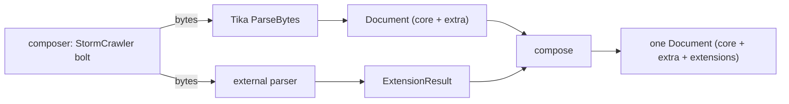

# TIKA-4771 sketch — composable Document, coordinator optional

Status: design for discussion (TIKA-4771). A contract proposal, not an
implementation.

## Where this sits against the ticket

TIKA-4771 as filed proposes Tika brokering registered external parsers, the way
fetchers and emitters register today, with Parse and ParseStream plugin modes.
This sketch is the contract-first take on the same goal: fix the envelope and
the composition rules first, so coordination can live anywhere — a StormCrawler
bolt today, a one-call service later, and an in-Tika broker, if wanted, becomes
one implementation of the contract rather than its definition. Round one ships
no broker.

## Who owns what

- StormCrawler (or any orchestrator): acquisition, exact bytes, provenance,
  and the composition itself.
- Tika: the Document and the composition rules.
- External parsers: their own result schemas.
- Consumers: unpack only the extension types they understand.

## Flow

    composer (SC bolt now; coordinator service later, same rules)
        │  bytes
        ├────► Tika ParseBytes ────► Document (core + extra)
        ├────► external parser ───► ExtensionResult
        └─ compose ─► one Document (core + extra + extensions)

## Proto

    message ExtensionResult {
      string producer_id = 1;           // names the composer's contribution slot,
                                        // not a service instance: the same service
                                        // called twice is two slots
      Status status = 2;                // OK | EMPTY | FAILED | SKIPPED
      google.protobuf.Any payload = 3;  // producer-owned schema; multiplicity inside
      repeated string warnings = 4;
      int64 elapsed_ms = 5;
    }
    // in Document:
    repeated ExtensionResult extensions = 40;   // the number the ticket already
                                                // names, left unassigned on the
                                                // 4795 branch

## Rules

1. Ownership is disjoint. core + extra belong to the core parse; extensions are
   append-only. An extension can't touch core fields.
2. Identity lives with the composer. Its work-item id names the plan, keys the
   dedup, and becomes the composed Document's id. The envelope carries no
   identity: it never travels alone in round one. A correlation field is an
   additive change the day envelopes go detached.
3. The composer hashes its input bytes and compares the result with Tika's
   origin.sha256, when present. A mismatch rejects the merge. External
   envelopes carry no digest in round one.
4. Duplicates are deterministic. Same slot, identical contribution: collapse to
   one. Same slot, different content: a conflict, independent of arrival order —
   neither is kept, the composer records a FAILED envelope for that slot with a
   warning, and the core Document stays valid.
5. One envelope per slot per call. Multi-part output (a preview per page) lives
   inside the producer's payload schema, not in N envelopes. This also defers
   streamed or partial contributions — the ticket's ParseStream mode — to a
   later round.
6. The composer answers for its whole plan. A producer that replied contributes
   its envelope; one that timed out or crashed gets a composer-synthesized
   FAILED envelope; one skipped by policy gets SKIPPED. The composed Document
   then accounts for every planned slot; the plan itself stays with the
   composer.

## Runtime

Sequential compose in one StormCrawler bolt: call Tika, call the parser, merge
in memory, emit. Parallel fan-out is a later round.

## Not in round one

- The in-Tika broker and plugin registration (the ticket's orchestration
  model): buildable later on these same rules, deliberately not their
  definition.
- ParseStream plugin mode: deferred with it, alongside the 4772 streaming
  conversation.
- Payload mappings (projecting an Any into a document shape): another day, per
  Kristian.
- Schema registry: later layer for discovery and JSON projection. Known types
  resolve from generated classes; unknown payloads round-trip as bytes.
- Embedded docs, block/span annotations: blocked on the typed content lane the
  Document doesn't carry yet. Any must not become the workaround for that.
- Producer authentication and registration are out of scope.

## Depends on

TIKA-4766 provides the Document contract. TIKA-4795 provides the exact-byte
path and parity oracle used by the first demo.

## Mermaid twin (GitHub venues only)

