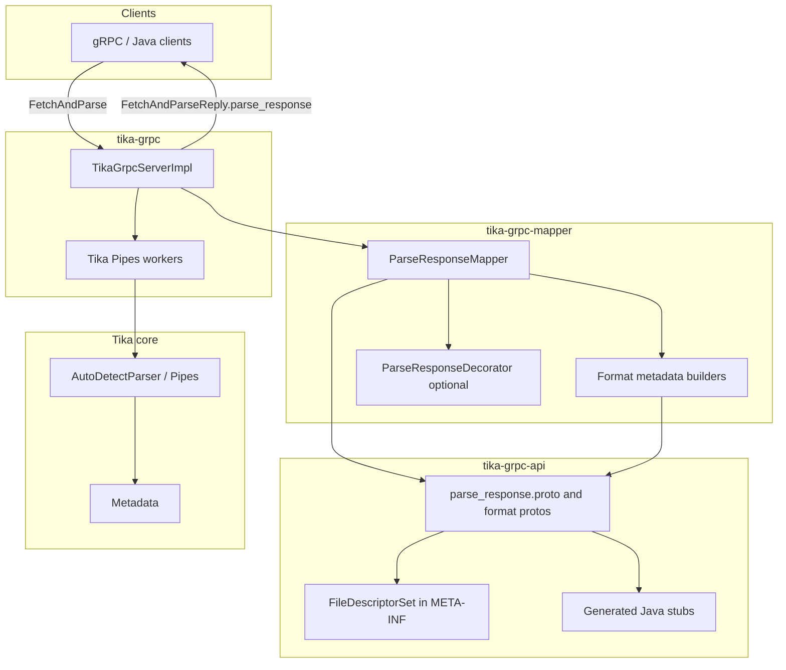
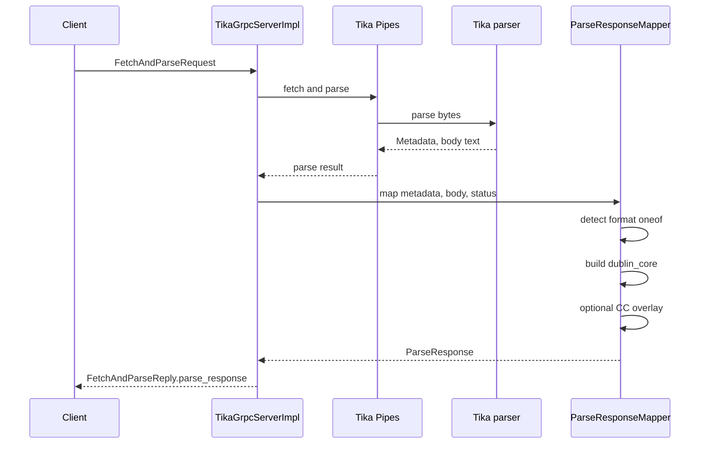
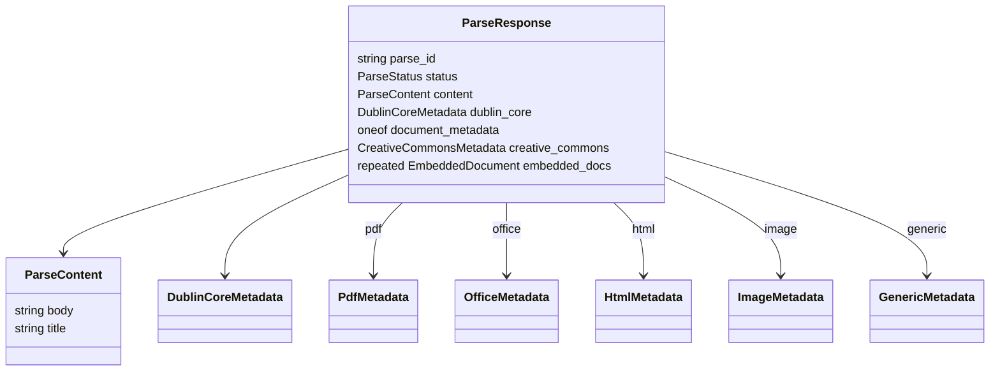

# Pull request: typed ParseResponse for Tika gRPC

Use the **Summary** section as the PR introduction (first few paragraphs). Use
**Architecture** and below for the full description.

---

## Summary

This change replaces the flat `map<string,string>` on `FetchAndParseReply` with a
typed `org.apache.tika.grpc.v1.ParseResponse`. Parse metadata is mapped from Tika
`Metadata` into protobuf messages aligned with Tika property interfaces (PDF, Office,
HTML, and the other supported formats), with Dublin Core normalized at the response
root and Creative Commons licensing carried on a dedicated field when present.

The work is split into three Maven modules so clients can depend on the schema and
generated stubs without pulling in the server, and so mapping logic stays testable
outside the gRPC layer:

- **tika-grpc-api** — protobuf sources, Java generation, bundled `FileDescriptorSet`
- **tika-grpc-mapper** — `ParseResponseMapper` and format builders; optional
  `ParseResponseDecorator` for future extensions (for example document outlines)
- **tika-grpc** — existing service; `FetchAndParseReply.parse_response` replaces
  the removed `fields` map

This is a breaking change for gRPC clients that read string keys from `fields`.
Migration is documented in `tika-grpc-api/README.md` and summarized in
`tika-grpc/README.md`.

## Architecture

### Module dependencies

### Parse pipeline

### ParseResponse layout

## Breaking API change

| Removed | Replacement |
|---------|-------------|
| `FetchAndParseReply.fields` (field 2, reserved) | `FetchAndParseReply.parse_response` (field 5) |

Example client reads:

- Body text: `parse_response.content.body`
- Title: `parse_response.content.title` or `parse_response.dublin_core.title`
- PDF producer: `parse_response.pdf.doc_info_producer`
- Parse status: `parse_response.status`

## Modules added or updated

| Path | Notes |
|------|-------|
| `tika-grpc-api/` | ~17 proto files under `org/apache/tika/grpc/v1/`; buf lint config; descriptor bundle |
| `tika-grpc-mapper/` | Builders ported from prior Pipestream mapper work; 35 unit tests against Tika test fixtures |
| `tika-grpc/` | Depends on api + mapper; `TikaGrpcServerImpl` uses `ParseResponseMapper` |
| `tika-bom/pom.xml` | Lists new artifacts |
| Root `pom.xml` | Reactor modules |

## Test plan

- [ ] `./mvnw -pl tika-grpc-api,tika-grpc-mapper,tika-grpc test`
- [ ] Confirm `FetchAndParseReply` no longer exposes `fields`; clients read `parse_response`
- [ ] Parse a PDF and an HTML sample via gRPC; verify typed `pdf` / `html` oneof and `content.body`
- [ ] Confirm `tika-grpc-api` jar contains `META-INF/org.apache.tika.grpc.v1.descriptors`
- [ ] Review breaking change note with downstream consumers before release

## Follow-up (not in this PR)

- Outline decorators (`ParseResponseDecorator`) for PDF/HTML heading trees when proto fields are added
- Expand `ClimateForecastMetadataBuilder` beyond additional_struct mapping
- Downstream consumer updates in separate repositories
